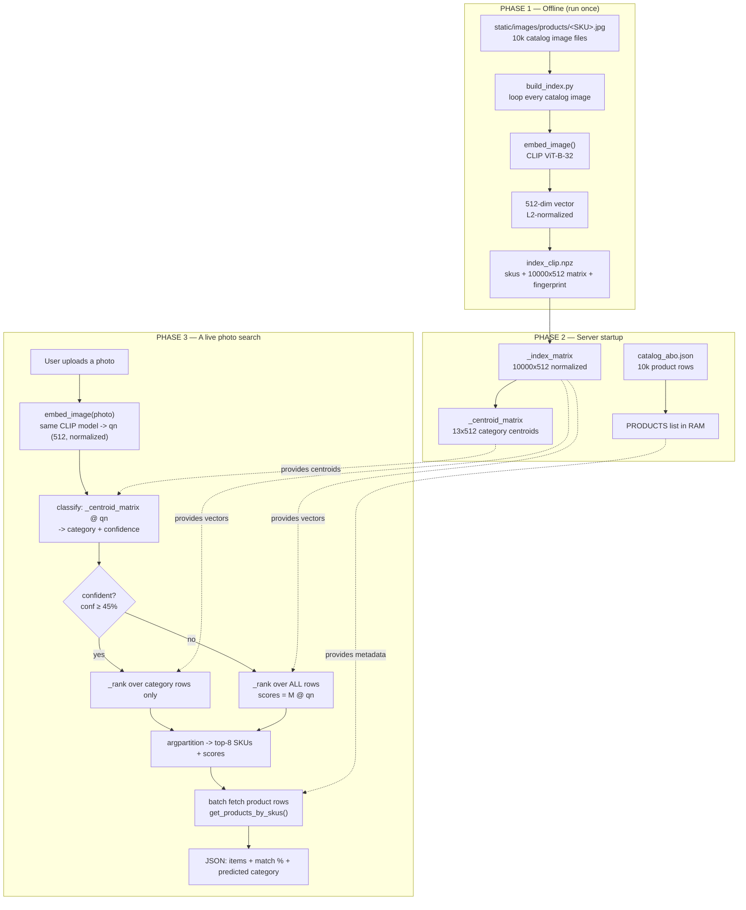
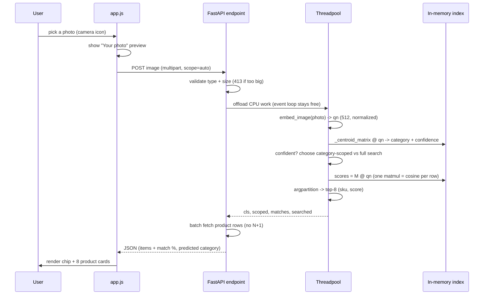

# How Visual Search Works — End to End

A detailed, step-by-step walkthrough of the "search by photo" pipeline in this
project: how the catalog is stored, how images become vectors, and how a user's
uploaded photo is matched against 10,000 products.

---

## The one idea everything rests on: an *embedding*

An **embedding** is a list of numbers (a **vector**) that represents an image as a
point in a high-dimensional space. With CLIP (our default model) each image
becomes a **512-number vector**. The model is trained so that **visually /
semantically similar images land close together** in that space and different
things land far apart.

So "find similar products" becomes "find the catalog vectors closest to the
uploaded photo's vector." Everything below is just: **turn images into vectors
once, then compare vectors fast.**

- "Close" is measured by **cosine similarity** — the cosine of the angle between
  two vectors. `1.0` = same direction (identical), `0` = unrelated.
- We **L2-normalize** every vector (scale it to length 1). Once all vectors have
  length 1, a plain dot product between two of them *equals* their cosine
  similarity — so the comparison is a single multiply-add.

---

## The whole pipeline at a glance



---

## Phase 1 — Offline prep (done once, before the server runs)

### 1. How the catalog is stored
The 10,000 products live in a plain JSON file: **`backend/data/catalog_abo.json`** —
a list of objects, each like:

```json
{ "sku": "ABO-B08FHH4RY4",
  "name": "Rivet Alfred Mid-Century Modern Chair",
  "brand": "Rivet", "category": "chairs",
  "price": 129.99, "list_price": 179.99,
  "rating": 4.4, "reviews": 456, "description": "…",
  "image_url": "/images/products/ABO-B08FHH4RY4.jpg" }
```

This is **just metadata + a pointer to the image file** — no vectors here.
`products_data.py` loads it into a Python list `PRODUCTS` (the in-memory catalog,
`data.backend: memory`) and builds a `_BY_SKU` dict for O(1) lookups.

### 2. How the catalog *images* are stored
The actual photos are files on disk at **`backend/static/images/products/<SKU>.jpg`**,
served by the web server at `/images/products/<SKU>.jpg`. Each product has one
JSON row **and** one image file named by its SKU.

### 3. How the catalog images get embedded (the offline batch job)
This is **`build_index.py`**, run once:

1. Loop every product that has an image file.
2. For each, read the bytes and call **`embed_image(bytes)`** (`embeddings.py`).
   On the CLIP backend that does:
   - Open the image with PIL, convert to RGB.
   - Run CLIP's `preprocess` (resize to 224×224, color-normalize) → a tensor.
   - `model.encode_image(tensor)` → a raw **512-dim vector**.
   - **L2-normalize** it (`feats / feats.norm`) → length exactly 1.0.
3. Stack all 10,000 vectors and save **`backend/data/index_clip.npz`**, containing:
   - `skus` — the SKU per row
   - `vecs` — the `(10000, 512)` float32 matrix
   - `fingerprint` — `clip:ViT-B-32:laion2b_s34b_b79k` (the model identity)

That `.npz` **is the precomputed search index.** Embedding 10k images with CLIP on
CPU takes ~12 minutes — which is exactly why we do it once, offline, and cache it.
**At runtime we never re-embed the catalog.**

> The **heuristic** backend has the same shape but the "embedding" is hand-math
> instead of a model: a 59-number vector = foreground color histogram + shape grid
> + edge-energy grid. It powers the zero-dependency mode; CLIP is the real one.

---

## Phase 2 — Server startup (`run.py` → `main.py` lifespan)

`_build_catalog_index()` runs on boot:

1. **Read config** (`config.yaml`) → backend is `clip`, catalog is `catalog_abo.json`.
2. **Load the catalog** → `PRODUCTS` list (10k rows) in RAM.
3. **Load the index** from `index_clip.npz`:
   - Verify the `fingerprint` matches the current model; if a *different* model
     built it, **refuse the stale cache** (don't silently mis-rank).
   - Read the `(10000, 512)` matrix, **L2-normalize every row**, hold it as
     `_index_matrix`, with parallel arrays `_index_skus` (SKU per row) and
     `_index_cats` (category per row).
4. **Build category centroids** (`_build_category_centroids`): for each of the 13
   categories, average all its product vectors into one **centroid** (the "average
   look" of that category), normalize, and stack into `_centroid_matrix` `(13, 512)`.
5. The **CLIP model itself is loaded lazily** — it comes into RAM (~577 MB, from the
   bundled `backend/models/hf`) on the *first* photo search. That's why the first
   search is slow (~6 s) and every one after is fast.

After startup everything needed is in memory: catalog rows, the normalized index
matrix, and the category centroids.

---

## Phase 3 — A live photo search, step by step



### On the browser (`app.js`)
1. User clicks the **camera icon** and picks a photo; `wireVisualSearch` catches it.
2. `startVisualSearch` stashes it as a data-URL in `sessionStorage`, navigates to
   `visual-search.html` (or searches in place if already there).
3. `renderVisualSearchResultsPage` shows the **"Your photo" preview immediately**,
   rebuilds a `File`, and calls `runVisualSearch(file)`.
4. `runVisualSearch` sends `POST /api/visual-search?scope=auto` with the image and
   shows the "Analyzing…" spinner.

### On the server (`main.py` → `visual_search`)
5. **Validate:** content-type must be `image/*`; reject oversized uploads with a
   clean **413** (Content-Length precheck + bounded read).
6. **Offload to a threadpool** so the heavy CPU work never blocks the async event
   loop. Inside `_do_visual_search`:
7. **Embed the uploaded image** with the *exact same* `embed_image()` path the
   catalog used — same model, same preprocessing, same 512 dims, same
   normalization. This is critical: **query and catalog must use the identical
   model**, or the vectors aren't comparable. Result: `qn`, a normalized 512-vector.
8. **Classify the category** (`_classify`): `sims = _centroid_matrix @ qn` gives 13
   cosine scores (photo vs each category centroid); a temperature-softmax turns
   those into probabilities → the top category + **confidence %** (the "Detected:"
   chip).
9. **Decide scope** (soft filter): if confidence ≥ 45% and `scope=auto`, search only
   that category's rows; otherwise search everything. A misclassification can't nuke
   results — low confidence falls back to the full catalog, and the chip lets the
   user override.
10. **Vectorized similarity search** (`_rank`):
    - Choose the rows: the whole `_index_matrix` `(10000, 512)`, or just the
      category's slice (e.g., the 1,061 chairs).
    - **`scores = M @ qn`** — one matrix-vector multiply. Since every row and `qn`
      are unit-length, each output number **is the cosine similarity** for that
      product. This single matmul replaces 10,000 comparisons and is sub-millisecond.
    - **`np.argpartition(-scores, k)`** grabs the top-*k* (default 8) without a full
      sort, then sorts just those 8. Returns `[(sku, score), …]`, best first.
11. **Hydrate the products** — one **batch lookup** `get_products_by_skus([...])`
    (no N+1), attach metadata, set `match_score = round(cosine × 100, 1)` (the
    "% match" on each card).
12. **Return JSON:** ranked items + `predicted_category`, `confidence`, `scoped`,
    and `searched` (how many vectors were actually compared — ~1,061 when scoped to
    chairs, 10,000 when not).

### Back on the browser
13. `runVisualSearch` updates the status, renders the **category chip**, and draws
    the 8 product cards with their match %.

---

## One sentence per stage

| Stage | What happens |
|-------|--------------|
| **Catalog** | A JSON list of product rows + image files on disk. |
| **Offline** | Embed every catalog image once (CLIP → normalized 512-vectors) → `index_clip.npz`. |
| **Startup** | Load catalog + index matrix + category centroids into RAM; CLIP model lazy. |
| **Query** | Embed the uploaded photo with the *same* model → classify category → matmul against the index → cosine scores → top-8 → look up products → return. |

**Why it's fast:** the expensive part (embedding 10k images) happened once,
offline. Every search is *one small model inference on the query* + *one matrix
multiply*.

**Why matches are relevant:** CLIP places a photo of a chair near other chair
photos in vector space, so the nearest vectors genuinely are similar-looking
products — and the category classifier trims cross-category noise.

---

## Where this maps to production (GCP)

The *shape* is identical; only the providers change:

| Local (this repo) | GCP production |
|-------------------|----------------|
| `embed_image()` (local CLIP) | Vertex AI Multimodal Embeddings (or CLIP on Cloud Run) |
| `_index_matrix` brute-force `M @ qn` | same brute force at 10k–50k; pgvector / Vertex Vector Search only at ≫100k |
| `PRODUCTS` list / `catalog_abo.json` | Cloud SQL (Postgres) |
| `static/images/` on disk | Cloud Storage + Cloud CDN |
| `build_index.py` offline | a Cloud Run Job that writes the index artifact to GCS |

See `frontend/architecture.html` (the ☰ menu → *Architecture Overview*) for the
full on-prem vs GCP diagram.
